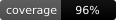

# prism-metrics

[](https://www.npmjs.com/package/prism-metrics)
[](#test-coverage)
[](#test-coverage)
[](#audit--verification)
[](LICENSE)

Open methodology and pure scoring implementations for the architecture
frameworks used by **prism0x2A**. Every scorer is a pure TypeScript
function: same input, same output, no I/O, no side effects.

📖 **[Read the Fachkonzept &amp; implementation audit handbook](https://dadenjo.github.io/prism-metrics/)** — every framework's definition, scoring formula, and audit findings in one document (also at [`docs/handbook.html`](docs/handbook.html)).

## Install

```bash
npm install prism-metrics
```

## Usage

```ts
import { analyzeSolid, SOLID_METHODOLOGY } from "prism-metrics/solid";

const result = analyzeSolid({
  analyzedFiles: 142,
  largeFiles: 6,
  heavyExportFiles: 3,
  largeSwitchFiles: 1,
  cascadingIfFiles: 0,
  strategyPatternFiles: 18,
  inheritanceFiles: 4,
  narrowingStubFiles: 0,
  totalInterfaces: 22,
  fatInterfaces: 1,
  hasDiContainer: false,
  abstractionPatternFiles: 9,
  directInfraImportFiles: 0,
});

console.log(result.overallScore, result.grade);
```

Every framework exports the same three things:

- a pure `analyze*` scoring function (no filesystem, network, or env access)
- a typed signal input interface
- a `*_METHODOLOGY` constant describing the definition, signals, formula, and any honest gaps

See `src/<framework>/methodology.ts` for the human-readable specs.

## Frameworks (14)

| Subpath | Description | Tests | Coverage |
| --- | --- | ---: | ---: |
| `prism-metrics/iso-25010` | ISO/IEC 25010 — 6 of 8 quality characteristics | 16 | 100% lines |
| `prism-metrics/solid` | SOLID principles — file/interface heuristics + optional AST signal | 38 | 98.8% lines |
| `prism-metrics/clean-arch` | Clean Architecture dependency-rule violations | 15 | **100%** |
| `prism-metrics/hexagonal` | Ports & Adapters violations | 17 | **100%** |
| `prism-metrics/eip` | Enterprise Integration Patterns detection | 20 | 100% lines |
| `prism-metrics/eda` | Event-driven pattern detection | 20 | 100% lines |
| `prism-metrics/conways-law` | Team/code coupling alignment proxy | 11 | 96.5% lines |
| `prism-metrics/wardley` | Wardley map evolution-stage classification | 20 | 100% lines |
| `prism-metrics/twelve-factor` | Twelve-Factor App per-factor scoring | 11 | 97.0% lines |
| `prism-metrics/monorepo` | Monorepo per-capability isolation health | 10 | **100%** |
| `prism-metrics/dora-predicted` | DORA four key metrics — predicted, not measured | 12 | 95.1% lines |
| `prism-metrics/ddd` | DDD bounded-context inference | 15 | **100%** |
| `prism-metrics/c4` | C4 model coverage (L1–L3, no headline score) | 17 | 99.0% lines |
| `prism-metrics/auto-detect` | Framework auto-detection from manifest signals | 13 | 94.3% lines |
| **core** (foundation) | InsufficientSignalResult + scanner-exclusions primitives | 43 | **100%** |

**Totals**: 278 tests passing · 96.4% line coverage · 88.1% branch coverage.

## Audit &amp; Verification

The 2026-06-09 multi-agent audit reviewed every framework against
its published methodology. **52 of 57 findings are closed** as of
0.7.0; the remaining 5 are LOW-severity items documented in each
framework's `honestGap`.

The complete audit — Fachkonzept, expected results, implementation
review per framework, plus empirical verification — lives in:

- 📖 [**docs/handbook.html**](docs/handbook.html) — single-file HTML handbook (629 LOC)
- 📊 [**docs/handbook.evidence.json**](docs/handbook.evidence.json) — machine-readable evidence per finding
- 📋 [**docs/scanner-exclusions.md**](docs/scanner-exclusions.md) — methodology disclosure for what gets skipped during a scan

Major audit-driven changes (0.4.0 → 0.7.0):

- **0.4.0**: foundation `InsufficientSignalResult` + scanner-exclusions module; iso-1/iso-2 (empty-input + security cliff)
- **0.5.0**: tf-1/tf-2 (deployment-target awareness + honest 'unknown'); mono-1/mono-2 (noData + polyglot); dora-1/dora-3 (insufficient guard + prediction confidence)
- **0.6.0**: c4-1/c4-2 (queue + client collisions); iso-3/iso-4 (continuous perf curve + churn double-count); 9 boundary/regression tests across tf, mono, dora, solid
- **0.7.0**: solid-lsp-ast (tiered LSP signal — optional `confirmedLspViolations` from AST analysers, fallback to substring scan)

See `CHANGELOG.md` for the per-version detail.

## Verify on your own data

Every scorer ships with `input.json` / `expected.json` fixture pairs
under `src/<framework>/__tests__/__fixtures__/`. To reproduce locally:

```bash
git clone https://github.com/dadenjo/prism-metrics
cd prism-metrics
npm install
npm test
```

The scorers are pure functions — same input, same output, no I/O.
Run with `--coverage` to see line/branch breakdown per module:

```bash
npx vitest run --coverage
```

Inside your own project:

```ts
import { analyzeCleanArch } from "prism-metrics/clean-arch";

const result = analyzeCleanArch({
  totalCapabilities: 24,
  unknownCapabilities: 2,
  adjacentViolations: 0,
  mediumViolations: 0,
  criticalViolations: 0,
});

// { score: 100, grade: 'A+', totalViolations: 0, ... }
```

## Scanner exclusions (methodology, not internals)

Production scorers in this package walk the filesystem and count regex
hits. To stay consistent with the published methodology, they share a
single exclusion contract — directories that are skipped (`node_modules`,
`__tests__`, `.claude/worktrees/`, …), filename patterns that mark a
file as test/fixture/mock, and a `stripComments` helper applied before
regex tests run.

These primitives are exported from `prism-metrics/core` as
`IGNORE_DIRS`, `TEST_FILE_PATTERNS`, `stripComments`, and
`shouldScanFile`. They are part of the methodology — silently skipping
files would look like cheating. Any downstream scorer that ignores them
is publishing a different methodology than this package documents.

See [`docs/scanner-exclusions.md`](docs/scanner-exclusions.md) for the
full list and the empirical trigger (Atomar's ISO 25010 Security `10 / F`
result driven by hits inside `.claude/worktrees/`).

## Test Coverage

Generated via `@vitest/coverage-v8`. Per-framework line / branch coverage
is tracked in [`docs/coverage-summary.json`](docs/coverage-summary.json)
and surfaced in the handbook's Verification box per framework.

| Framework | Lines | Branches | Score-file lines |
| --- | ---: | ---: | ---: |
| clean-arch · ddd · hexagonal · monorepo | **100.0%** | **100.0%** | 100% |
| eda · eip · iso-25010 · wardley | 100.0% | 84–99% | 100% |
| c4 · solid | 98.8–99.0% | 96.9–97.6% | 98% |
| twelve-factor | 97.0% | 98.3% | 94% |
| conways-law | 96.5% | 93.3% | 93% |
| dora-predicted · auto-detect | 94–95% | 92–94% | 89–90% |
| **TOTAL** | **96.4%** | **88.1%** | |

## Honest gaps

The methodology constants spell out where signals are weak — heuristic
naming, sample caps, predictive-not-measured for DORA, 6-of-8 for ISO
25010, single-team-undefined for Conway's Law. **Read the `honestGap`
field before using a score in production.**

The handbook's "Cross-cutting findings" + per-framework "Implementation
audit" sections document every known limitation explicitly.

## License

MIT
